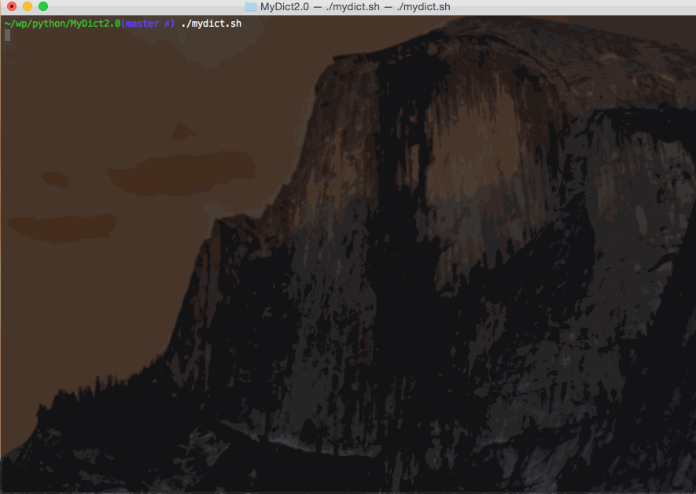

# MyDict

## 功能特性
- 离线、在线查询英文单词
- 在线查询英文词组，中文词汇
- 在线翻译（中译英，英译中）
- Tab键单词补全

## 运行环境
- Unix/Linux + Python3

## 配置

1. 修改根目录下**mydict.sh**,指明程序所在目录。根据需要在shell搜索路径中建立mydict.sh的软连接，方便在控制台直接启动
2. [下载](http://pan.baidu.com/s/1o6ojxpC)离线词典数据库并放在根目录下
3. **根据经验，调节控制台比原始大小更大一些能获得程序运行的最好效果。**另外如果有必要，修改根目录下CONFIG配置文件，主要为了人工控制兼容各种控制台大小，正常情况下不需要配置

## 按键说明
-  ctrl-n       向下选择候选词
-  ctrl-p       向上选择候选词
-  ctrl-l       清空输入
-  ctrl-k       在翻译和查词模式间切换
-  Tab          补全输入单词
-  Enter        查询确认
-  ESC          后退（也用于退出程序）
-  BackSpace    删除一个字母

## Tips
- 离线查询**只**支持英文单词，如果自己输入单词后没有候选词或与第一个高亮词不同，说明本地没有该单词，查询会自动变为在线查询。别的所有查询都是在线的。
- 在线查询是阻塞的，所以如果时间过长，可以按下ctrl-c取消后再查询
- 查词和翻译两种模式可以随时切换，即使在查词模式中正在输入也可通过ctrl-k换到翻译的界面

## 声明和致谢
- 感谢百度提供的词典API、翻译API
- 本项目遵循[MIT协议](LICENSE.txt)
